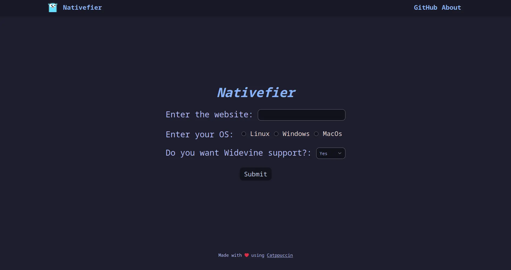
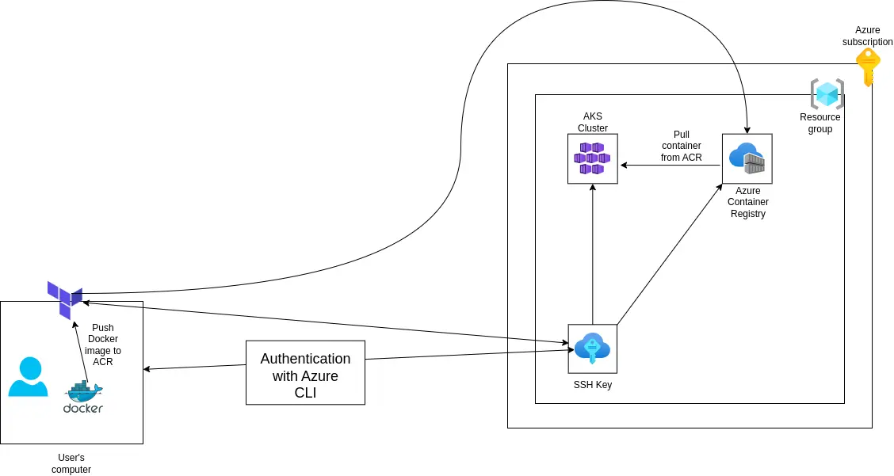

<h3 align="center">Nativefier Downloader</h3>


<p align="center">
  <a href="https://github.com/ghostx31/website-nativefier/stargazers"></a>
  <a href="https://github.com/ghostx31/website-nativefier/contributors"></a> 
</p>



Nativefier Downloader is a Golang and Tailwind CSS based project to convert your favourite websites into native-looking Electron apps!

Just enter the URL of your favourite website, select your OS and bam! You have an Electron app ready to use!

This project internally uses the [Nativefier NPM package](https://github.com/nativefier/nativefier) for building Electron apps.

### Network architecture 



### Contributing

If you wish to add a new feature, write your contributions on a new branch and open a PR against the dev branch.

### Building the Docker container 

- From the root of the repository run the command:
```bash
docker build --network=host -t nativefier:latest .
```

- To run the built docker container: 
```bash
docker run -p 1323:1323 nativefier:latest
```

- Now browse to `localhost:1323` to get to the page. 

- A docker image on dockerhub is also available. To use this image, run 

```bash
docker run -p 1323:1323 spookyintheam/nativefier:latest
```

### Helm Chart for Kubernetes

The repository also includes a helm chart with HPA for autoscaling. To build and deploy the helm chart, from the root of the project directory, run:

```bash
helm install nativefier nativefier-helm-chart/
```

Then get the external IP of the deployment's load balancer by running `kubectl get svc`. Open the external IP address in the URL bar to access the project's homepage. 

### Terraform deployment 

This project can also be deployed to Microsoft Azure Kubernetes Service using Terraform. The terraform deployment creates an AKS deployment and deploys the helm chart on this deployment. 

To get started with the deployment, first initialize the terraform providers by running:

```bash
terraform init -upgrade
```
Once the providers are downloaded, apply the terraform deployment. 

```bash
terraform plan -out azure.tfplan
terraform apply azure.tfplan 
```

**Note:** 
  1. You will need to update the `null_resource` which pushes the Docker container to Docker Hub in the terraform deployment with your own repository's name for the `null_resource` to work. 
  2. The AKS cluster's SKU is basic but you're free to change this if you have a premium Azure subscription.

### TODO

- [x] Support Electron apps for all three major OSes. 
- [x] Better frontend
- [x] Push image to dockerhub and also create a Kubernetes deployment Helm chart.
- [x] Add Terraform deployment
- [ ] Refine support for different versions of macOS.
- [ ] OS detection from browser (planned but not sure if I'll implement this).
